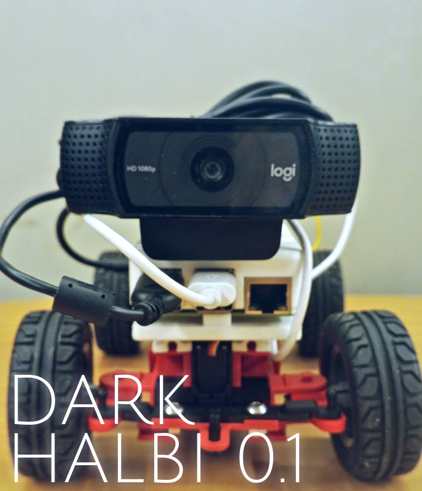

## Intro

This is the official Github repository for The Adakademy Team, before known as Adagroup, conformed by Jesser Palma, Jesús Alcalá and Hector Cartagena. This repository contains all the code, documentation, and resources for our project, HALBI. This is our third year participating in WRO

---
# Team Members

* Jesús Alcalá, 20 years old, jdam5000@gmail.com
* Héctor Cartagena, 18 years old, cartagenahector0608@gmail.com
* Jesser Palma, 20 years old, jssrpalma3@gmail.com
---
# Folders structure 
```
ADAKADEMY-WRO2025/
├── models/
├── other/
├── schemes/
├── src/
├── t-photos/
├── v-photos/
└── videos/
```
Where:

- `models`: Every 3D/CAD file used in the car. [view](./models/README.md)
- `schemes`: Wiring diagram, assembly explanation and components description. [view](./schemes/README.md)
- `src`: All code necessary to control the robot. [view](./src/README.md) 
- `t-photos`: team photos. [view](./t-photos/README.md)
- `v-photos`: vehicle photos. [view](./v-photos/README.md)
- `videos`: performance videos of the robot. [view](./videos/README.md)


## Our last prototype
At first, we planned to design the car from scratch, modeling and printing our own 3D pieces, including the chassis and direction, Although it seemed like a good idea at first, as we progressed we started to face problem after problem, we realized that our current design would give us more problems, at the end we tried our best with the time constraints we had, and this was the vehicle we presented at WRO 2024, Cybercooper.


## Dark halbi (Our current prototype)

Given the resources we currently had, our main idea was to re-design Cybercooper, modifying the existing base, strategy and using better electronic components; we started printing the new parts with white material and thinking of better ways to assemble the car direction.

At the end, we decided to use a premade base for the chassis, the main reason for this was to save time ( and headaches) with the mechanical design, giving us more time to focus on the electronics and programming.

So we bought the maker kit car from the german enterprise **[Fischertechnik](https://www.fischertechnik.de/de-de/produkte/maker/571900-maker-kit-car)**, now we present a more profesional approach with a better documentation and totally new code sctucture,


<div align="center">



</div>


As the kit is made of parts like lego we just design pieces to be compatible with the chassis, after we designed the pieces we fixed the components with screw/glue/Double-side tape. But our inspiration it continues being the Cybertruck of tesla. We have many goals and we are excited about the future because each year we get better to bring betters solutions.

<div align="center">


</div>


## Mobility

Our vehicle is made the [Ackermann steering mechanism](https://www.youtube.com/results?search_query=ackermann+geometry), which is a geometric  configuration used in vehicle steering systems to ensure that when turning, the inner and outer wheels travel along different radii, preventing tire scrubbing and maximizing cornering stability. This is achieved by steering the front wheels at different angles, with the inner wheel turning at a greater angle than the outer wheel. And is propelled by a differential that we explain with detail here


## Software

We developed the software using python3 as our main programming language and using Thonny/Terminal as code editor.

We wanted to keep the code as simple as possible and use a single language, in order to make this possible we used a library called Pyfirmata which enables us to merge the microcontroller code and the raspberry code in a single unit. 

#### Image Processing

We use the raspberry camera to capture the image, which is converted from BGR format to LAB `(lightness, green-red, blue-yellow)`. We use this colorspace because it's easier to detect the colors, regardless of the environment lighting.

We then use OpenCV to apply a threshold to the image, which returns a mask image with the pixels that reside within the specified color range, we can also reduce processing time by only searching within a specific region of interest on the screen.


### Obstacle Detection

For Obstacle detection, we specify various color ranges that coincide with the color of the obstacles, red and green. After the camera captures the image, we apply gaussian blur and median filters to get a sharper image, the program then applies thresholds to get masks with the colors we are interested in, with this mask we can detected the screen position of the obstacles and the contours of the circuit wall, which can be used to decide the turning direction of the car based on a proportional derivative (PD) algorithm, which involves calculating the differences between the area of the walls.


Looking for more? go to projects folders [Here](#folders-structure) !
