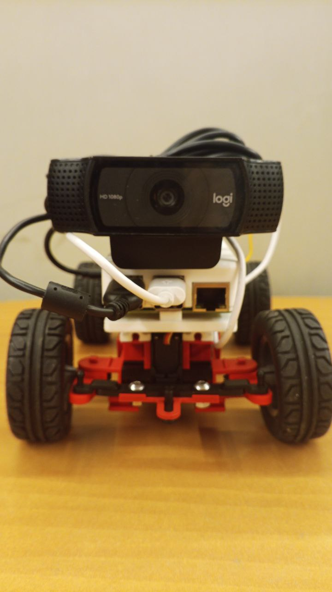
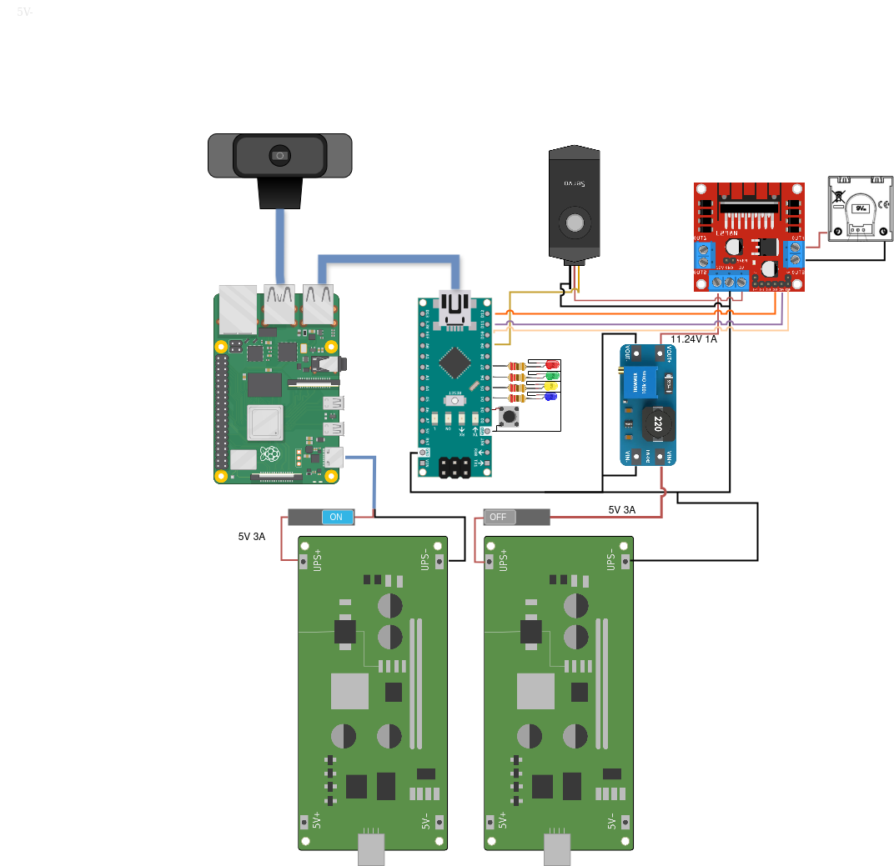
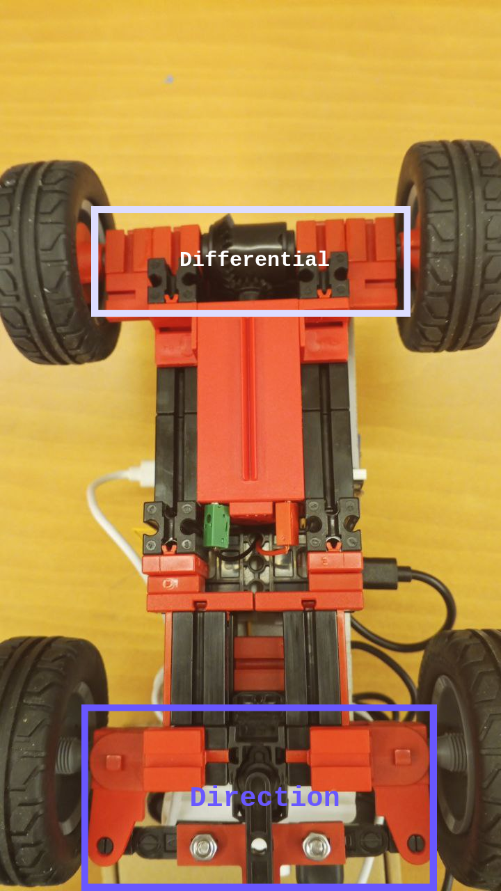
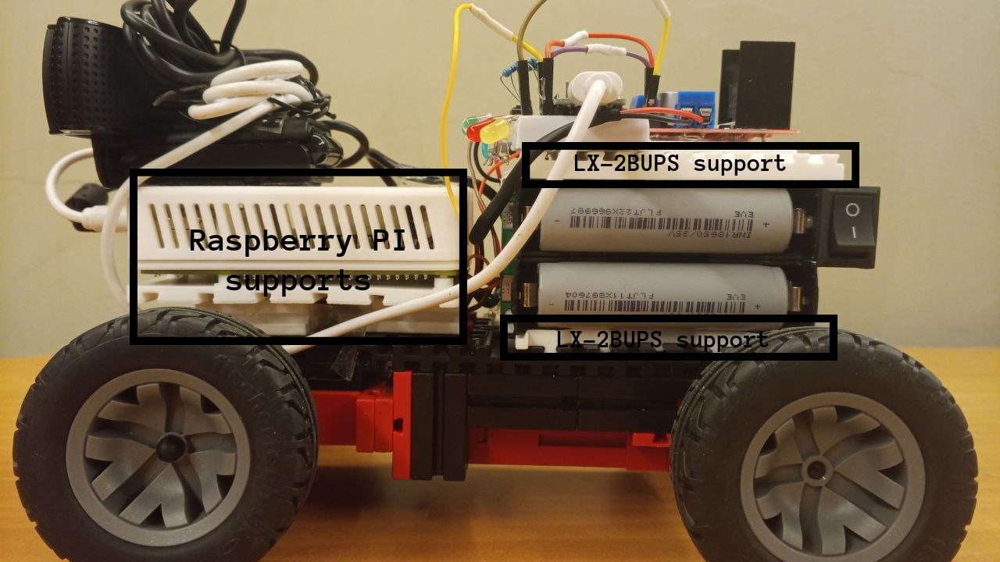
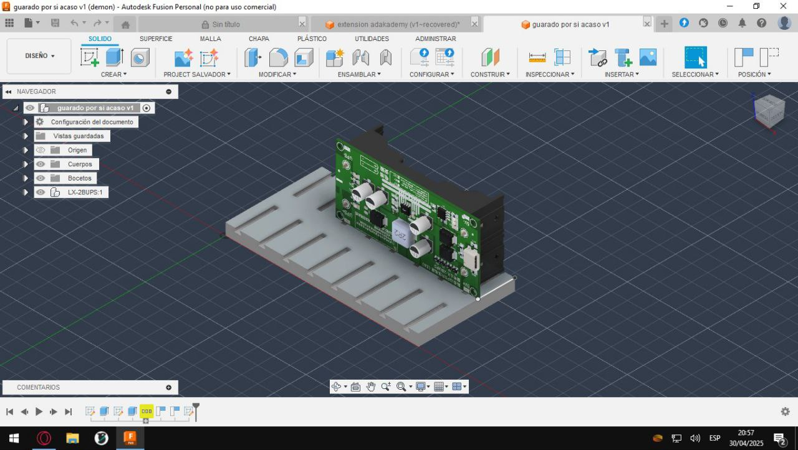
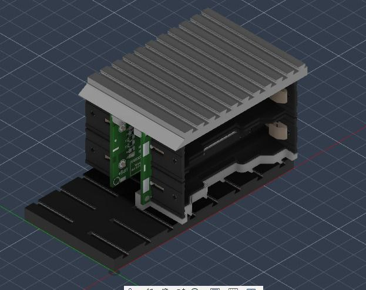
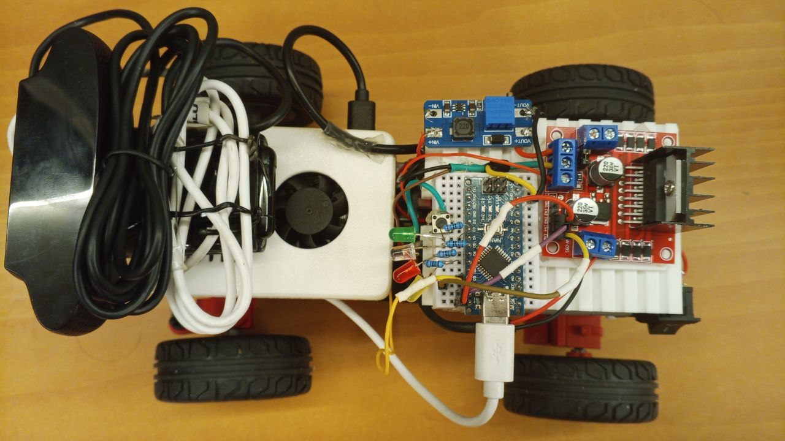

# Hardware documentation and setup guide

## Table of content

* [List of components](#list-of-components)

* [Components description](#components-description)
  
  *  [Raspberry PI 4 B](#raspberry-pi-4-b)

  * [Fischertechnik kit](#fischertechnik-kit)

  * [Li-on 18650 batteries, LX-2BUPS MT3068](#li-on-18650-batteries-lx-2bups-mt3068)

  * [Arduino nano](#arduino-nano)

  * [L298n](#l298n)

  * [Fischertechnik Micro servo Nr. 132292](#fischertechnik-micro-servo-nr-132292)

  * [Ecorder motor 9v Nr. 153422](#ecorder-motor-9v-nr-153422)

  * [Logitech C920X](#logitech-c920x)

* [Assembly](#assembly)
  * [Wiring diagram](#wiring-diagram)
  * [Power description](#power)
  * [Drive](#drive)
  * [3D desing proccess and assembly](#3d-desing-proccess-and-assembly)

* [Recommendations for future fevelopment](#recommendations-for-future-development)
## List of components

| Cantidad | Producto               | Precio Unitario | Total |
|----------|------------------------|----------------|-------|
| 1        | [Raspberry Pi 4 B](https://www.amazon.com/Raspberry-aleaci%C3%B3n-resistente-refrigerada-ventilador/dp/B07XTRK8D4/ref=sxin_16_pa_sp_search_thematic_sspa?__mk_es_US=%C3%85M%C3%85%C5%BD%C3%95%C3%91&content-id=amzn1.sym.2da95b6c-f59a-4699-bc43-d0ff036c6388%3Aamzn1.sym.2da95b6c-f59a-4699-bc43-d0ff036c6388&crid=1MNN6HXZPRQX8&cv_ct_cx=raspberry%2Bpi%2B4&keywords=raspberry%2Bpi%2B4&pd_rd_i=B07XTRK8D4&pd_rd_r=8fd6db19-a9bf-49f2-bed5-d85f62162bf9&pd_rd_w=PCH4o&pd_rd_wg=RHQgL&pf_rd_p=2da95b6c-f59a-4699-bc43-d0ff036c6388&pf_rd_r=PBJ9HR8999TXWA966P2T&qid=1749992437&sbo=RZvfv%2F%2FHxDF%2BO5021pAnSA%3D%3D&sprefix=raspberry%2Caps%2C240&sr=1-1-6024b2a3-78e4-4fed-8fed-e1613be3bcce-spons&sp_csd=d2lkZ2V0TmFtZT1zcF9zZWFyY2hfdGhlbWF0aWM&th=1)       | $110.00        | $110.00 |
| 1        | [Car chassis with motor and servo](https://www.amazon.com/-/es/fischertechnik-Maker-Kit-Car-571900/dp/B0CY31DGT1/ref=sr_1_1?__mk_es_US=%C3%85M%C3%85%C5%BD%C3%95%C3%91&crid=1U5LDJG1N012B&dib=eyJ2IjoiMSJ9.A4y-GcKAwAbaTNsidmYvDQ.2Dl1_C7M_3siNlFrrKAdwcWGiPjo24JfKghV4CarK_E&dib_tag=se&keywords=maker%2Bkit%2Bcat%2Bfischertechnik&qid=1749992612&sprefix=maker%2Bkit%2Bcat%2Bfishertecnk%2Caps%2C160&sr=8-1&th=1)            | $152.00        | $152.00 |
| 4        | [18650 Batteries x 2](https://articulo.mercadolibre.com.ve/MLV-822728792-bateria-de-litio-recargable-18650-37v-7800mah-_JM?searchVariation=187506651449#polycard_client=search-nordic&searchVariation=187506651449&position=19&search_layout=grid&type=item&tracking_id=f46731bc-e110-4c1c-9e3a-39f03dcf9778)        | $10.00         | $20.00 |
| 1        | [Webcam logitech](https://www.amazon.com/Logitech-correcci%C3%B3n-funciona-Facetime-port%C3%A1til/dp/B085TFF7M1/ref=sr_1_2_sspa?__mk_es_US=%C3%85M%C3%85%C5%BD%C3%95%C3%91&crid=3TDC9UPMF20PS&dib=eyJ2IjoiMSJ9.xVtRFzFOfA678C9UfJ2P5Dh7j6AKD4iv-V9zhwnZJXYCh_6zM88bwBS9VWgL2w_3mGaa2uxe9o4cdBsL_BgvjWHHZFlQwZxXSu3xHKbtXKtLgqanXwZcBUa0IPpJwXPXFle4j_EGkZhlpLKyFrCyaBbO1DKFYX44vGxHypHBBBW-Tg9L1-hBbx0JGQr6ErvXTTHn_He7u6W-2lBIAIKn1cV0Sgqn6bM11UwhxpLHdY8.GIJKphlEnDWzfzEERyJukzgF15AKXsN6z6yUqVvDWP0&dib_tag=se&keywords=webcam%2Blogitech&qid=1750028423&sprefix=webcam%2Blogitech%2Caps%2C324&sr=8-2-spons&sp_csd=d2lkZ2V0TmFtZT1zcF9hdGY&th=1)        | $70.00         | $70.00 |
| 1        | [MT6068](https://www.amazon.com/-/es/Buying-M%C3%B3dulo-impulso-ajustable-MT3608/dp/B0CWKWX7QC/ref=sr_1_1?__mk_es_US=%C3%85M%C3%85%C5%BD%C3%95%C3%91&crid=3AMK4Y558HYRY&dib=eyJ2IjoiMSJ9.TLalRqJgBH_tYg3eQzefQNBWcCAoerGOdsZZi5tRkJtDW1CjUQosN4toICQahARr.I6Dv41TBneu-vEf_xEvgYoSrcdCVc65wJ83TyWypJHQ&dib_tag=se&keywords=mt3068&qid=1749993307&sprefix=mt3068%2Caps%2C191&sr=8-1)                 | $3.00          | $3.00  |
| 1        | [L298N](https://www.amazon.com/-/es/WWZMDiB-L298N-controlador-Arduino-Raspberry/dp/B0CR6BX5QL/ref=sr_1_4?__mk_es_US=%C3%85M%C3%85%C5%BD%C3%95%C3%91&crid=3O8OXGKCCVRG0&dib=eyJ2IjoiMSJ9.hK2FjV8Ukp8CCyVTI1seMk4n3aguoO_lNXX3xoiH-O0C4rrvapYby0KxsXYQdeAe863BgigxTsz1ePawqec8Hh-ZvnLMo-m-4Dm_xbIy8313Qvap61RJcd5w5fRsxA1Mfu7r-1bPw7I6tgDfFY8-XvbRp4S63ohCGnn4r_olt3NPelIGMHtKNp3R0LG1qMBP1e27x9q6fx21i5dQHcNxvQLKsGfCJHzstSjLouT-lF4.GfRYImaJhtuQGrdEbIedHfK0ZnReNVJ_VW1xuDtjz-4&dib_tag=se&keywords=l298n&qid=1749993492&sprefix=l298n%2Caps%2C179&sr=8-4)                  | $5.00          | $5.00  |
| 1        | [Arduino nano](https://www.amazon.com/-/es/Nano-conexi%C3%B3n-compatible-Arduino-V3-0/dp/B0B42GRG15/ref=sr_1_2?__mk_es_US=%C3%85M%C3%85%C5%BD%C3%95%C3%91&crid=XW2BW8O1LXM1&dib=eyJ2IjoiMSJ9.qqetOTfNU56DCiKxDKpSY1mJEp8ImS6fK8GCDePazTZaNWy--wqAeFwbylHjbgMSjt8DkzFqzdbxxYSuczs_68pbBBsiqJ6JERyDANoDy1gFkr6ldjTNF-jhcupMFGeJYIE2pryL8jTW0DCCXmgjpUt_ZpGP6j7KaDwpF--Tap-TNBCnpWQudo4_N5-gKTl1qrjA9gm8z87yWbz5P9jGuOvQq81twJbp41PbsbeNKyM.VhK3Ex_WQ2P9kw3wiIa67gyryce4fQk7YtvEOlWEpdY&dib_tag=se&keywords=arduino+nano+usb+c&qid=1749993530&sprefix=arduino+nano+usb+c%2Caps%2C198&sr=8-2)           | $10.00         | $10.00 |
| 2        | [LX-2BUPS 5v](https://www.amazon.com/-/es/Bater%C3%ADa-M%C3%B3dulo-Cargador-Tablero-Indicador/dp/B0CGZS38QR/ref=sr_1_1?__mk_es_US=%C3%85M%C3%85%C5%BD%C3%95%C3%91&crid=136Q8NU91WK25&dib=eyJ2IjoiMSJ9.OUZ7CB2S6RhhunyygWStlhYXdkOxEQWEOd7igJQg-ILCCJFEW-Is87jcLbWIrBYqBUWPaTZceymcS13W2cNtIA.zeXlgUhXAuX3iUN4TpHTLoBrpBR5GAd59arz0m_-F44&dib_tag=se&keywords=lx-2bups&qid=1749991945&sprefix=lx-2bups%2Caps%2C289&sr=8-1&th=1)               | $5.24          | $10.48 |
| 2        | [USB cable type C](https://www.amazon.com/paquete-cables-trenzados-iPhone-Samsung/dp/B0DPMQ7291/ref=sr_1_2_sspa?__mk_es_US=%C3%85M%C3%85%C5%BD%C3%95%C3%91&crid=19WFOH9SGQR6X&dib=eyJ2IjoiMSJ9.TwlOm7HeKVsOKER2sTeYNLD5mWAyTg5X856GRR8FkQvdG6_mf3AkJUFATBnv2BeM8xp9pvV-C07pI8XJwoQ_eKhFW_LFDsdW4gMXxY4SR16LNgk9hBwUKvpjZFP6bFsEPKocQuodZaAIRYU69ZSXUM4tDsU4ICjfgal6OKZ0AduJXFmkanzaBUevDxYOerGFGKB3YJBU--yu-UaFZyqTN1Tva5bVN1G6vEmKS4970rU.FvhJ8ACjur6SL9B8e6yG-afZRtFQW6M1iDPJC9vrJN0&dib_tag=se&keywords=usb%2Bcable%2BC&qid=1749992275&sprefix=usb%2Bcable%2Bc%2Caps%2C204&sr=8-2-spons&sp_csd=d2lkZ2V0TmFtZT1zcF9hdGY&th=1)       | $6.00          | $12.00 |
| 2        | ON OFF Switch     | $2.5          | $5.00 |
| 1       | [Indications LEDs](https://www.amazon.com/-/es/MCIGICM-circuitos-experimentos-cient%C3%ADficos-multicolor/dp/B07PG84V17/ref=sr_1_1?__mk_es_US=%C3%85M%C3%85%C5%BD%C3%95%C3%91&crid=34TV9PKSNPYBI&dib=eyJ2IjoiMSJ9.cK4CwVBcvXGqzlCWlCXE35U8AEF7YUYdftEfJlolABKfHDeAY4cXJaZ0g5192vPE2KHdPs3H5jQh1AK5mX9trJRurvfjsHG79EfL5JWOhmJffO7Q7Vbz23WkPxdsCxxONU2n0msMWrqzLL1VVMOmqL6fnz0uNnkdN6bg-3eseqtFNSgzCL6tJWrprDzb1ZGceXhWotxA9vxpLHfEjXE_4ni-3W4HtRW5MiANBQrV8KI.9IKBwWYKULyRvT0BDqzXIF9Se-L0Q9LRTKr_iQNFIJs&dib_tag=se&keywords=leds%2Barduino&qid=1750688479&sprefix=leds%2Barduino%2Caps%2C230&sr=8-1&th=1)     | $4          | $4.00 |
| **Total** |                        |                | **$401.48** |

---

## Components description

### Raspberry PI 4 B  

The Raspberry Pi 4 Model B  is a powerful, credit-card-sized single-board computer (SBC)  developed by the Raspberry Pi Foundation. It is widely used in robotics, IoT projects, and embedded systems due to its versatility, performance, and affordability. 

Our strategy is centered on computer vision algorithms developed by us using **[Opencv](https://opencv.org/)** with python, for that reason we have choose this computer given that have a low electrcity consumption (5v 3A) contrary to the pi 5 (5V 5A 😬 To high!) besides is better option that the pi 3 B that we used the last time.

These are the features of our raspberry PI 4:

| Feature | Description |
|--------|-------------|
| **Type** | Single-Board Computer (SBC) |
| **Processor** | Quad-core Cortex-A72 (ARM v8) @ 1.5GHz |
| **Memory (RAM)** | 8GB |
| **Storage** | microSD card slot |
| **Connectivity** | Wi-Fi 802.11ac (2.4 GHz / 5 GHz), Bluetooth 5.0, Ethernet |
| **USB Ports** | 2 x USB 3.0, 2 x USB 2.0  |
| **Video Output** | 2 x micro-HDMI ports supporting up to 4K resolution |
| **Camera Support** | MIPI CSI camera interface |
| **GPIO Pins** | 40-pin GPIO header (supports I²C, SPI, UART, PWM) |
| **Operating System** | Raspberry Pi OS |
| **Power Supply** | 5V / 3A via USB-C port |

---
### Fischertechnik kit 
The Fischertechnik Maker Kit Car is a pre-assembled chassis that provides a solid foundation for creating functional models or prototypes of vehicles. It includes essential components such as wheels, motors, axles, and structural elements that allow users to build a stable base for their projects. The kit is compatible with various motors, sensors, and other electronic components, making it ideal for integrating advanced functionalities like autonomous driving, obstacle avoidance, or remote control. The design is modular, enabling easy modifications and upgrades as needed. This flexibility allows users to experiment with different configurations and mechanical setups without needing to start from scratch.

Kits like this are ideal for teams new to robotics because they eliminate the need for extensive mechanical assembly or 3D modeling skills. By using a pre-assembled kit, you can focus on higher-level tasks such as programming, sensor integration, and algorithm development without worrying about building the physical structure from scratch. This approach is particularly beneficial for educational purposes, as it allows students to quickly prototype ideas and test concepts without getting bogged down by mechanical complexities. Additionally, many international teams use similar kits, making it a widely accepted and practical choice for competitions like the World Robot Olympiad (WRO).

While pre-assembled kits offer convenience, designing and 3D-printing your own chassis provides several advantages. First, custom chassis designs allow for greater flexibility and optimization, enabling you to tailor the vehicle to specific requirements such as weight distribution, component placement, and cost-efficiency. A well-designed custom chassis can also be more durable and reliable than off-the-shelf kits, which may have fragile parts that are not easily replaceable. Furthermore, creating your own chassis fosters deeper learning in mechanical engineering, CAD modeling, and prototyping—skills that are highly valued in robotics and engineering competitions. While it requires more time and technical expertise upfront, the ability to iterate and refine your design based on testing results leads to a more robust and competitive robot. Ultimately, while pre-assembled kits are great for getting started, building your own chassis offers superior customization, cost savings, and educational value, making it the preferred choice for advanced teams aiming to push the boundaries of innovation in the WRO FE category.

---
### Li-on 18650 batteries, LX-2BUPS MT3068

The robot uses two 18650 Li-ion batteries  combined with an LX-2BUPS MT3068 power management module , which allows the system to function without complex circuitry or custom-built charging solutions. This setup provides a stable power source for both the Raspberry Pi and motor driver, making it suitable for teams without advanced electronics experience. The LX-2BUPS module acts as a UPS (uninterruptible power supply), ensuring smooth transitions between charging and discharging states. However, this configuration has some limitations: the 18650 batteries are relatively large, making space management within the chassis challenging. Additionally, these batteries have limited runtime when powering high-consumption components like the Raspberry Pi, especially during intensive tasks such as image processing. 

To address voltage requirements for the motors, we included a step-up module to boost the output to 11.24V , allowing the motors to operate at optimal speed. While this setup works well for basic operation, it lacks a Battery Management System (BMS) , meaning there’s no automatic balancing of charge between the two batteries. As a result, one battery may discharge faster than the other, potentially leading to unstable power delivery or overheating. Despite its drawbacks, this energy solution was chosen because our team lacked the expertise to design and implement a more advanced Li-Po-based system from scratch. It serves as a functional starting point that enables us to focus on software and sensor integration while preparing for future improvements through custom-designed power circuits. 

---
### Arduino nano
For our autonomous vehicle project, we chose the Arduino Nano with USB-C  as the primary microcontroller to handle sensor inputs, motor control, and coordination with the main Single-Board Computer (SBC), such as a Raspberry Pi. This decision was driven by both practical and ergonomic considerations—primarily, our team’s preference for the USB-C interface , which offers better durability, faster data transfer, and reversible plug orientation compared to older micro-USB connectors. 

While the Arduino Nano (USB-C version) is not strictly required for this project, its compact size, wide community support, and compatibility with the Firmata2 protocol  made it a natural fit for rapid prototyping and integration with Python-based control logic running on the SBC. 

this are some features from our arduino :
| Feature | Description |
|--------|-------------|
| **Type** | Microcontroller board |
| **Microcontroller** | ATmega328P (Nano v3) |
| **Clock Speed** | 16 MHz |
| **Flash Memory** | 32 KB (0.5 KB used by bootloader) |
| **SRAM** | 2 KB |
| **EEPROM** | 1 KB |
| **Digital I/O Pins** | 14 (of which 6 provide PWM output) |
| **Analog Input Pins** | 8 channels with 10-bit resolution |
| **Power Supply** | 5V regulated input |
| **Input Voltage (recommended)** | 7–12V |
| **Current Draw (typical)** | ~20 mA |
| **Communication Interfaces** | UART, SPI, I²C |
| **Programming Language** | C/C++ using Arduino IDE or PlatformIO |
---
### L298n
The L298N H-Bridge module  is a dual motor driver commonly used in robotics to control the direction and speed of DC motors. It allows bidirectional motor control using Pulse Width Modulation (PWM) signals from microcontrollers like Arduino or Raspberry Pi. This makes it ideal for basic robotic platforms where simplicity and ease of use are prioritized over high efficiency. 

While the L298N is user-friendly and widely available, it has some limitations such as high voltage drop  (around 1.5V–3V per motor), which reduces the effective voltage delivered to the motors. This can affect performance, especially when using lower-voltage batteries. Additionally, it tends to generate significant heat , often requiring heatsinks or cooling solutions during prolonged operation. We don't opt for more efficient drivers like the DRV8833  or TB6612 , which offer better energy efficiency and thermal performance because find or deliver those drivers for Venezuela is very hard. However, for early development and testing, the L298N remains a solid choice due to its ease of integration and widespread community support.

---
### Fischertechnik micro servo Nr. 132292
A servomotor  (or servo) is a type of motor commonly used in robotics, automation, and control applications where precise angular positioning  is required. Unlike regular DC motors that rotate continuously, servos are designed to move to a specific angle and hold that position until instructed otherwise.

A standard **servomotor** consists of:

1. **DC Motor**: Provides rotational force.
2. **Gear Reduction System**: Slows down the motor’s rotation and increases torque.
3. **Position Sensor (Potentiometer)**: Monitors the current shaft position.
4. **Control Circuitry**: Compares the desired position with the actual one and adjusts the motor accordingly.

Servos receive **control signals** through Pulse Width Modulation (PWM). The width of the pulse determines the angle the motor should turn to:

- **~50 Hz signal (every 20 ms)**
- **Pulse width determines position:**
  - `1.0 ms` → ~**0°**
  - `1.5 ms` → ~**90° (neutral)**
  - `2.0 ms` → ~**180°**

This makes servos ideal for our ackerman direction. Here are some features from that servo:

| Feature | Description |
|--------|-------------|
| **Voltage Range** | 4.8V – 6.0V |
| **Control Signal** | PWM (Positive Edge Triggered) |
| **Neutral Position** | Approx. 1500 µs (microseconds) |
| **Rotation Angle** | ~60° ±10° |
| **Torque @ 4.8V** | 1.8 kg·cm |
| **Torque @ 6.0V** | 2.2 kg·cm |
| **Speed @ No Load** | 0.13 sec/60° at 4.8V / 0.11 sec/60° at 6.0V |
| **Dead Band Width** | 8 µs |
| **Current Consumption (Idle)** | 200 mA stopped / 1000 mA running (no load) |
| **Wire Length** | 240 mm |
| **Plug Type** | JR Universal (Brown = GND, Red = VCC, Orange = Signal) |

**NOTE:** You can use other servo if you can adapt it to the kit but you don't have to use exact the same 
### Ecorder motor 9v Nr. 153422

An **encoder motor** is a DC motor equipped with an **integrated encoder**, which allows for **precise measurement of rotation speed, direction, and position**. This feedback makes it ideal for applications that require accurate motion control, such as autonomous navigation, distance estimation, or path correction. The encoder generates electrical pulses as the motor shaft rotates, and by counting these pulses, the robot can determine how far it has traveled or how fast it is moving, but we're only using the motor wihtout sensing the position of the motor.

Here are the motors features:

| Feature | Description |
|--------|-------------|
| **Supply Voltage** | 9V DC (motor side), 3.3–9V DC (encoder side) |
| **Encoder Type** | Push-Pull Output (0/9V), max. 10 mA |
| **Resolution** | 3 pulses per motor revolution (or 6 when counting both rising and falling edges) |
| **Gear Ratio** | 1:21.3 |
| **Encoder Frequency** | Up to 1 kHz |
| **Signal Interface** | 3-pin header |
| **No-Load Speed** | ~200 rpm (±22) at 9V |
| **Stall Torque** | 1.3 kg·cm minimum |
| **Stall Current** | 1.3A maximum |

---

### Logitech C920X

The **Logitech C920X** is a high-definition USB webcam designed for video conferencing, streaming, and general-purpose imaging applications. It features a **1080p HD sensor** with autofocus, built-in microphone array, and compatibility with most operating systems, making it a versatile vision sensor for robotics projects.

In our autonomous vehicle setup, we use the **C920X as the primary camera** for visual perception tasks such as:
- Line detection (blue and orange lines)
- Obstacle avoidance
- Traffic sign recognition
- Parking alignment using color-based segmentation

#### 🔧 Key Features:

| Feature | Specification |
|--------|----------------|
| **Resolution** | Full HD 1080p at 30 fps |
| **Autofocus** | Yes – allows sharp image capture even while moving |
| **Microphone** | Built-in stereo microphones |
| **Compatibility** | Works with Windows, Linux, macOS |
| **Interface** | USB 2.0/3.0 (plug-and-play) |
| **Mounting Options** | Clip-on or tripod mount |
| **Field of View** | 78° diagonal field of view (ideal for line detection) |

Thanks to its **UVC (USB Video Class)** compliance, the C920X can be used directly with OpenCV and Python on platforms like Raspberry Pi without requiring special drivers. This makes it ideal for real-time image processing and autonomous decision-making in robot vehicles.

Although not originally designed for robotics, the C920X has become a popular choice among teams due to its affordability, reliability, and ease of integration with Single Board Computers (SBCs) like **Raspberry Pi**.

---
#### 🚫 Limitations

- **Fixed Focus:** While it has autofocus, lighting conditions affect performance significantly.
- **No Hardware Trigger:** Not ideal for synchronized sensor fusion but acceptable for basic vision tasks.
- **Size and Weight:** Slightly bulkier than alternatives like the Arducam or Raspberry Pi HQ Camera.

Despite these limitations, the **Logitech C920X** serves as an excellent starting point for building a functional vision system in the WRO 2025 competition.

---
## Assembly

To test new ways to achive the goal and win the competition, we make a lot of investigation watching videos, others teams repositories we choose the [Maker kit car from Fischertechnik](https://www.fischertechnik.de/de-de/produkte/maker/571900-maker-kit-car) , and after testing we could notice this about our election:

- The chassis have many fragile parts.
- Have a deviation on the direction because the wheels oscillate. 
- The wheels axis are made from plastic so if you put much weight it will broke. 

So if you're starting we recommend it but we determine is better inversion to model your own chasis.

Leaving that aside, we decided to use a premade base for the chassis, the main reason for this was to save time ( and headaches) with the mechanical design, giving us more time to focus on the electronics and programming.

For the assembly we are gone supose that you have follow the assamble insructions of the [company](https://apps.fischer.de/ecom/fischertechnik/digitale-bauanleitungen/maker-kit-car.htm), **please take in count that maybe you will have to use glue in some parts of the kit car** beacuse the are some parts like the servo axis that are easy to remove and with the vibration it will expulse the pieces that aren't fixed pieces

---

### Wiring diagram

Remember to buy every component before start building

--- 

### Power

A short explanation of the power supply hierarchy of the robot

- 18650 battery `3.7v 2000mAh` x 2
  - LX-2BUPS `5V 3A`
    - Raspberry PI 4 `5v 3A`
      - Arduino nano `5v` powered by USB C cable
      - Logitech camera
    
- 18650 battery `3.7v 2000mAh` x 2
  - LX-2BUPS `5V 3A`
    - MT3068 `5v 3A` --> `11.24v 1A`
      - L298N `12v MAX` 
        - Micro Servo `5v`
        - Encorder motor `9v`

### Drive

the kit use an simple Ackerman direction powered by a servo with 1.8kgcm standing torque, said direction is a geometric design principle used in vehicles to ensure that both front wheels turn at different angles when making a turn, allowing the vehicle to move smoothly around corners without skidding. This system uses a linkage setup that enables the inner wheel to turn sharper than the outer wheel, following the natural arc of the turn. In the Fischertechnik Maker Kit Car , the Ackermann steering mechanism is implemented using a set of tie rods connected to the front wheels. [We recommed this video to learn more about it](https://www.youtube.com/watch?v=hsQO5C0adQk)

While the propulsion is made by a mechanism called "diferential" wich  Maker Kit includes, is a mechanical system that allows the driven wheels of the vehicle to rotate at different speeds while receiving power from the same source. This is essential for smooth turning, as it enables one wheel to move faster than the other when the vehicle corners, preventing skidding and reducing tire wear. In the context of the WRO 2025 FE category, this type of differential is typically used in rear-wheel-drive configurations where an electric motor powers both rear wheels through a shared axle. While the kit’s differential simplifies the drivetrain design and improves maneuverability, it may not be suitable for advanced autonomous driving tasks due to its mechanical limitations and potential lack of precision control compared to software-based or independent motor control.

### 3D desing proccess and assembly

We bought the chasis and it arrives 2 months later, at the beggining we get scared because of the space so we begin to think how to save space to place every component.

After days and a lots of headaches we find the solution to put every component.

the front part of our car is essentially the [raspberry case]() elevated with [extension parts](../models/Extension%20base.3mf) desingned by our own, upper to RPI is the camera fixed with double-sided tape. The RPI is located in a way that you could use the USB ports, we choose this because we have two components that need the USB connection.

For the UPS modules we have model two supports that join both powersupply and hides almost every connection, the down part join the fits in the chasis of the maker kit car but before to put the modules you have to solder the switchs and the cables.

In our case we fixed the switchs with industrial glue but you can do some 3d print holder for it. The top part is used as base for the nano, l298n module (wich have its own base to fit in the other one), and the mt3608.

## Recommendations for future development  

As a recommendation for other teams, we suggest two key improvements to enhance both the performance and compactness of your autonomous vehicle: 

  * Design a Custom PCB: 
    Creating your own custom printed circuit board (PCB)  allows you to integrate all essential electronics — such as motor drivers, voltage regulators, microcontroller, and sensor interfaces — into a single, compact board tailored to your robot’s needs. This not only reduces the overall size but also improves reliability by minimizing loose connections and simplifying wiring. 

  * Use a LiPo Battery with Dedicated Charger: 
    Replacing standard battery packs with a LiPo (Lithium Polymer) battery  and using a dedicated charging circuit can significantly reduce weight and space usage while offering better power efficiency. LiPo batteries provide higher energy density and longer runtime, which is especially beneficial in high-drain applications like motor control and onboard computing. 
     

These are our goals for improvement in the next season, and we believe they will help us build a more efficient and competition-ready vehicle. 

Additionally, we recommend conducting thorough research and planning  before purchasing components. Doing a deep investigation on each part — including compatibility, power requirements, and long-term usability — helps avoid unnecessary expenses and ensures every component contributes meaningfully to the final design. 

