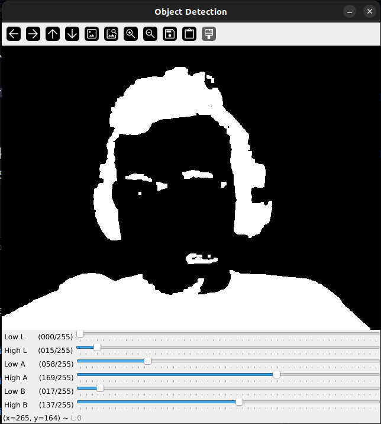
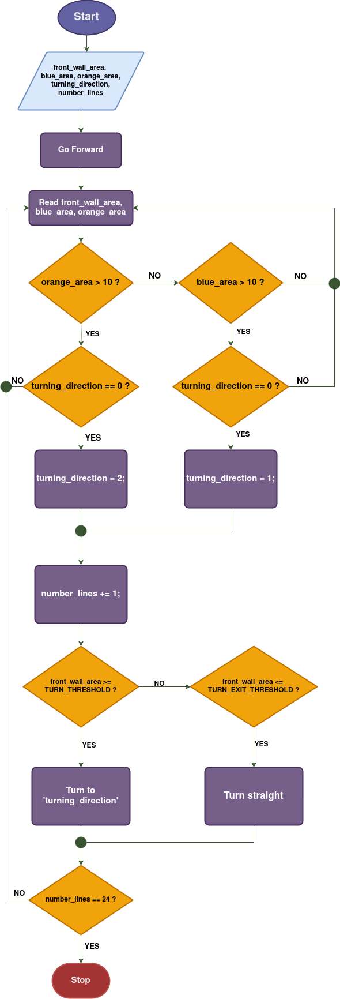

# Software documentation

This section provides an overview of the software architecture  used in our autonomous vehicle for the WRO 2025 Futuros Ingenieros  competition. It includes:

* The programming languages and tools used

* A high-level description of the system's modules

* How the robot processes sensor data, makes decisions, and controls hardware

* Integration with vision systems (e.g., line detection, traffic sign recognition)

* Communication between controllers (e.g., Raspberry Pi ↔ Arduino Nano)

# Folders structure 
```
ADAKADEMY-WRO2025/src/
├── modules/
|    ├── board.py
|    ├── vision.py
|    └── halbi.py
├── utils/
|    ├── movement_test.py
|    ├── color_tester.py
|    └── vision_test.py
├── constants.py
├── open_challenge.py
└── obstacle_challenge.py
```
Where:

- `modules/board.py`: This is ArduinoController class manages Arduino hardware (LEDs, buzzers, servos, and motors via a L298N driver) using pyfirmata2.

- `modules/vision.py`: To Capture and process images to detect colored objects within a region of interest (ROI) using a Raspberry Pi camera.

- `modules/halbi.py`: Is the main class compossed by the other to that is used to program both challenges, this class is configured to be easy to program your car without worrying about complex stuff. 

- `utils/movement_test.py`: Is an implementation with pygame that allows you to control the car like an FPV car to test everything related with the movement.


- `utils/color_tester.py`: Is an opencv code to calibrate the mask that will be detected. This file was recover from [ASPARAGUS team](https://github.com/kylln20/WRO_FE_2023-24/blob/main/src/ColourTesterLAB.py) which has the fifth place on the international of 2024

- `utils/vision_test.py`: Is used to see how the masks are working and finish the calibration process 

- `constants.py`: Are all the values that don't change like arduino pins, indicators leds

- `open_challenge.py`: is the final code for the first challenge.

- `obstacle_challenge.py`: is the final code for the second challenge.

**Note:** to run any file of the project you have to do this first: 

- Clone the repo
```bash
git clone  https://github.com/JD277/ADAKADEMY-WRO2025.git
```
- Install dependencies
```bash
pip install opencv-python numpy pyfirmata2
```

- Move to the project folder
```bash
cd ADAKADEMY-WRO2025
```

- excute the file that you want using this structure (remember to upload standarfirmata.ino to your nano! Check it [here](https://www.youtube.com/watch?v=RS35q6ksU6w&list=PLY1rn9AjOKu0FGn8SNnd4FJ-BG-Qqnkti))
```bash
python3 -m src.open_challenge
```

This way to execute the files is because we need that python read the folders as modules that is the reason of the init files in the directories because with that python understands how to use the imported files as a packages. 

## Table of contents

* [New code vs Past code](#new-code-vs-old-code)

* [Code description](#code-description)

* [Calibration](#calibration)

- [Open challenge](#open-challenge)
  - [Strategy](#open-challenge-strategy)
  - [Flowchart](#open-challenge-flowchart)
  - [Explanation](#open-challenge-explanation)
  - [Recommendations](#open-challenge-recommendations)
- [Obstacle challenge](#obstacle-challenge)
  - [Strategy](#obstacle-challenge-strategy)
  - [Flowchart](#obstacle-challenge-flowchart)
  - [Explanation](#obstacle-challenge-explanation)
  - [Recommendations](#obstacle-challenge-recommendations)

<div align="justify">

## New code vs Old code
Before to start explaining our code we like to show our improvements compared with the last year.

the last year we used a code wich use POO and funcional programming in C++ on Arduino IDE but all the code was in only one file with a lot of lines that difficulted to implement new things and debugging, with that we learn we need to go back two steps to continue and we focus to learn python/C++, POO, algortihms in a very deep way.

With this we re-read our code and begin to enchance our code taking the class for Serial comunication that we made, and we decided (after getting a new raspberry) to make all our code based on firmata protocol, we made this beacuse for debugging is easier to review one code than two in differents languages and as one of us don't donminates C++ we choose python.

That selection let us to create a better way to organize everything and now we can show a profesional work with a POO using pydoc comments.

## Code description

This is a complete description of every class attribute and method with its args, we recommend to see this first before to jump to the others section and when you clone the repository use this as guide to navigate in our code.

---
 
### board.py (class ArduinoController) 

#### Dependencies  
- `time`  
- `pyfirmata2`  
- `src.constants`


#### Description of the constructor method

```python
    def __init__(self, port=None):
        """
        Initializes the connection with Arduino.
        If no port is specified, it attempts to autodetect.
        """
        # If port is not provided, auto_setup returns the proper port
        self.board = pyfirmata2.Arduino(port)

        # Start the iterator to continuously read data from Arduino
        self.iterator = pyfirmata2.util.Iterator(self.board)
        self.iterator.start()

        # Dictionaries to store components
        self.servos = {}
        self.motors = {}
        self.leds = {}
        self.buzzers = {}
        self.buttons = {}
```

The constructor initializes the Arduino board using the provided port or auto-detects it if none is given. It also starts an iterator thread for continuous data reading and initializes dictionaries to store various components (LEDs, servos, motors, buzzers, buttons).  

---

#### Attributes description:  

<div align="center">

|Attribute|Datatype|Functionality|
|---------|--------|-------------|
|`board`|`pyfirmata2.Arduino`|Represents the connection to the Arduino board.|
|`iterator`|`pyfirmata2.util.Iterator`|Thread that continuously reads data from the Arduino.|
|`servos`|`dict[int, pyfirmata2.Pin]`|Stores servo motor objects indexed by their pin number.|
|`motors`|`dict[str, dict]`|Stores DC motor configurations, indexed by motor ID. Each entry includes in1, in2, and enb pins.|
|`leds`|`dict[int, pyfirmata2.Pin]`|Stores LED objects indexed by their pin number.|
|`buzzers`|`dict[int, pyfirmata2.Pin]`|Stores buzzer objects indexed by their pin number.|
|`buttons`|`dict[int, pyfirmata2.Pin]`|Stores button objects indexed by their pin number.|

</div>

---

#### Method description:  

<div align="center">

|Method|Args|Return|Description|
|------|----|------|-----------|
|`setup_led()`|`pin: int`|None|Configures a digital output pin for an LED and stores it in `self.leds()`.|
|`led_on`|`pin: int`|None|Turns on the LED connected to the specified pin.|
|`led_off()`|`pin: int`|None|Turns off the LED connected to the specified pin.|
|`setup_buzzer()`|`pin: int`|None|Configures a digital output pin for a buzzer and stores it in `self.buzzers`.|
|`buzzer_on()`|`pin: int`|None|Activates the buzzer connected to the specified pin.|
|`buzzer_off()`|`pin: int`|None|Deactivates the buzzer connected to the specified pin.|
|`setup_servo()`|`pin: int`|None|Configures a servo motor on the specified pin and centers it.|
|`set_servo_angle()`|`pin: int`, `angle: float`|None|Sets the angle of the servo motor (0–180 degrees).|
|`setup_motor()`|`in1_pin: int`, `in2_pin: int`, `motor_id: str`, `enb_pin: int`|None|Configures a DC motor using DRV8833/L298N driver and stores it in `self.motors`.|
|`set_motor_speed()`|`motor_id: str`, `speed: int`|None|Controls the speed and direction of the motor (-255 to 255).|
|`setup_button()`|`pin: int`|None|Configures a button with internal pull-up resistor and enables state reporting.|
|`button_callback()`|`data`, `pin: int`|None|Callback triggered when the button state changes; updates the button's state.|
|`is_button_pressed()`|`pin: int`|`bool`|Returns `True` if the button is released (HIGH), `False` if pressed (LOW).|
|`interactive_test_menu()`|None|None|Provides a console-based menu to interactively test all connected components.|
|`close()`|None|None|Stops the iterator and closes the connection to the Arduino board.|

</div>

---

#### vision.py (class VisionController)

#### Dependencies  
- `cv2` (`cv`)  
- `numpy` (`np`)  
- `src.constants`

#### Description of the constructor method

```python
def __init__(self, usb_port):
    """
    Initialize the vision controller with the desired resolution

    Args:
        width: is the widness of the cam resolution
        height: is the the high of the cam resolution
    """
    self.image_width  = 640
    self.image_height = 480
    self.image_lab = 0
    self.frame = any
    self.camera_cap = cv.VideoCapture(usb_port)
    self.camera_cap.set(cv.CAP_PROP_FRAME_WIDTH, self.image_width)
    self.camera_cap.set(cv.CAP_PROP_FRAME_HEIGHT, self.image_height)
```

The constructor initializes a video capture object using OpenCV to interface with the USB camera connected at the specified port. It sets the resolution to 640x480 by default and prepares internal variables for storing raw frames and processed LAB images.

---

#### Attributes description:  

<div align="center">

|Attribute|Datatype|Functionality|
|---------|--------|-------------|
|`image_width`|`int`|Stores the width of the camera resolution. Default is 640 pixels.|
|`image_height`|`int`|Stores the height of the camera resolution. Default is 480 pixels.|
|`image_lab`|`numpy.ndarray` or `int`|Stores the current image in LAB color space after processing. Initially set to `0`.|
|`frame`|`numpy.ndarray` or `any`|Stores the most recent raw frame captured from the camera.|
|`camera_cap`|`cv.VideoCapture`|OpenCV VideoCapture object used to interface with the USB camera.|

</div>

---

#### Method description:  

<div align="center">

|Method|Args|Return|Description|
|------|----|------|-----------|
|`receive_image()`|None|None|Captures a frame from the camera, stores it in `self.frame`, converts it to LAB color space and applies Gaussian blur.|
|`draw_roi(roi)`|`roi`: ROI object with `x1`, `y1`, `x2`, `y2`|None|Draws a green rectangle on the current frame representing the region of interest (ROI).|
|`draw_contours(cnt, roi, color)`|`cnt`: contour data<br>`roi`: ROI object<br>`color`: tuple (B, G, R)|None|Draws detected contours inside the specified ROI on the current frame.|
|`find_contours(range, roi)`|`range`: list of lower/upper color bounds<br>`roi`: ROI object|`list` of contours|Detects and returns contours within a given color range and region of interest using LAB color space and morphological operations.|
|`max_contour(contours, roi)`|`contours`: list of contours<br>`roi`: ROI object|`list` `[area, x, y, contour]`|Finds and returns the largest valid contour along with its area and center coordinates relative to the full camera frame.|

</div>

--- 

### `halbi.py` (class HALBI)

#### Dependencies  
- `src.modules.vision.VisionController`  
- `src.modules.board.ArduinoController`  
- `src.constants`

---

#### Description of the constructor method

```python
def __init__(self, serial_port: any, camera_port: any):
    """
        
    """
    self.vision = VisionController(camera_port)
    self.board  = ArduinoController(serial_port)

    self.turns: int = 0
    """Number of turns the car has made in the circuit"""

    self.first_color_detected : int = 0
    """First color that the camera detected\n 
    0 = None
    1 = Red, 
    2 = Green, 
    3 = Blue,
    4 = Orange
    """

    self.turning_direction: int = 0
    """Direction that the car will be running in, this will by determined by the vision controller\n
    1 = Left,
    2 = Right,
    0 if the camera hasn't detected the direction."""

    self.DEBUG_MODE = True
    """Optional mode for debugging"""
```

The constructor initializes both the `VisionController` and `ArduinoController` with the provided serial and camera ports. It also sets up internal state variables to track the robot's behavior such as number of turns, detected color, turning direction, and debug mode.

---

#### Attributes description:  

<div align="center">

|Attribute|Datatype|Functionality|
|---------|--------|-------------|
|`vision`|`VisionController`|Interface to manage image capture and processing from the camera.|
|`board`|`ArduinoController`|Interface to control hardware components via the Arduino board.|
|`turns`|`int`|Counts how many turns the car has performed during navigation.|
|`first_color_detected`|`int`|Indicates the first color detected by the vision system (`0`: none, `1`: red, `2`: green, `3`: blue, `4`: orange).|
|`turning_direction`|`int`|Stores the current turning direction (`0`: not set, `1`: left, `2`: right).|
|`DEBUG_MODE`|`bool`|Enables or disables debug features like interactive testing menus.|

</div>

---

#### Method description:  

<div align="center">

|Method|Args|Return|Description|
|------|----|------|-----------|
|`setup_HALBI(pins)`|`pins: dict`|None|Rapidly configures all necessary pins on the Arduino for LEDs, motor, servo, buzzer, and button. Raises an error if any required pin is missing.|
|`Stop()`|None|None|Stops the motor, centers the servo, and turns off all LEDs. Used to safely halt HALBI's movement.|
|`Start()`|None|`bool`|Returns the current state of the start button. Typically used to detect when the user presses it to begin operation.|
|`go_forward(speed)`|`speed: int = 255`|None|Moves the car forward at the specified speed. Also updates LED indicators accordingly.|
|`go_backward(speed)`|`speed: int = 255`|None|Moves the car backward at the specified speed. Also updates LED indicators accordingly.|
|`turn_left()`|None|None|Turns the steering to the left and activates appropriate LED feedback.|
|`turn_right()`|None|None|Turns the steering to the right and activates appropriate LED feedback.|
|`turn_direction()`|None|None|Applies the stored turning direction (`left`, `right`, or `center`) based on `self.turning_direction`.|
|`turn_center()`|None|None|Centers the steering servo to neutral position and adjusts LEDs.|
|`_test()`|None|None|Internal method for testing components; only runs if `DEBUG_MODE` is enabled. Currently calls the ArduinoController's test menu.|
|`close()`|None|None|Safely closes the connection to the Arduino board. Should be called before exiting the program.|

</div>

---

## Calibration

For the calibration this is the process that we suggest to make the car working properly.

1. Hardware:

Ensure that every components is connected like the [wire diagram](../schemes/Wiring_diagram.png) , and test if all mechanics parts are placed fine.

2. Movement test:

To test the movement you can use the `movement_test.py` file you just have to connect your car to one hdmi screen to start pygame correctly and excute: 

```bash
python3 -m src.utils.movement_test.py
```

And now you can use the car like an FPV car that you can control with WASD keys, if everything is working.
**Note:** Remember to turn on the car motors 

3. Mask configutation
Now you have to calibrate the colors mask using the color tester, so you have to modify the masks that are on constants.py file, so excute, modify and test!

```bash
python3 -m src.utils.color_tester color_name
```
this is what should see after calibration (in this case we are using black color)

<div align="center">



</div>

You must do this with every color!! And with this now you can just start to evaluate your robot for the WRO competition


---

## Open challenge
### Strategy

As our car have a camera with little field of view (78°), we can't manage the internal walls because th car would enter on infinite loop of turns, so as our car is small and the direction is very accurate, the car just keep moving forward waiting to reach the a thresh with greater than 30000 black pixeles with one line (blue or orange).

With this we don't have to worry about the internal walls because we will always in the outside lane.

### Flowchart
<div align="center">



</div>

So, here's how our robot makes its decisions during the competition. When we start the robot clicking the button, it first initializes all the important variables it needs to navigate—like `front_wall_area`, `blue_area`, `orange_area`, and `turning_direction`. These help it understand what’s going on around it based on camera input. Then, the robot starts moving forward, constantly scanning its surroundings using its vision system to detect colors and obstacles in real time.

Now, here's where the smart part comes in. If the robot sees a big orange area, it knows it should turn right, and if it sees a big blue area, it decides to turn left—but only if it hasn’t already chosen a direction. It also keeps track of how many lines or segments it has passed using the `number_lines` counter. When it detects a wall directly in front of it beyond a certain threshold, it turns accordingly. But if the obstacle disappears, it just goes straight again. This helps the robot react dynamically to the environment without needing exact pre-programmed paths.

And finally, once the robot completes 24 line crossings, which means it’s finished navigating the full course, it stops automatically. This whole process lets our robot make decisions on the fly, adapting to the track while staying fast and efficient—super.

### Recomendations

We recommend to use another camera with better field of view to make easier to build betters the ROIs to manage every case, because if our car for anything turns bad it could go straight to the wall. 

## Obstacle challenge
### Strategy

### Flowchart
### Recomendations

</div>